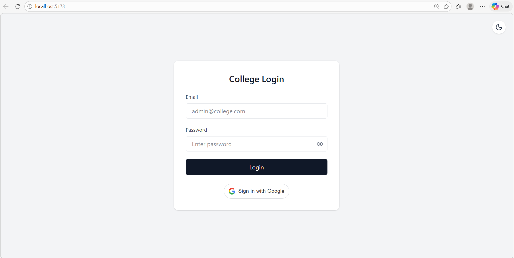

# 🎓 College Management System 

A **full-stack web application** developed to streamline and manage core
college administrative operations.\
This project is designed for **academic use**, demonstrating modern
frontend development, backend API design, database integration, and
modular architecture.

------------------------------------------------------------------------

## 📌 Overview

The College Management System provides a centralized platform for
managing administrative workflows such as authentication, admin profile
management, and college information management.

It uses:

-   **React (Vite)** for frontend
-   **Node.js + Express** for backend
-   **MySQL** for database
-   **JWT** for authentication

The project follows a clean **frontend-backend separation structure**
suitable for academic submission and GitHub presentation.

------------------------------------------------------------------------

## ✨ Features

-   🔐 Secure login system using JWT
-   🧑‍💼 Admin dashboard
-   🏫 College profile management
-   🖼️ Logo upload and preview
-   🗄️ MySQL database integration
-   ⚙️ Modular backend API structure
-   📦 Organized React component architecture
-   🟢 GitHub Actions build monitoring

------------------------------------------------------------------------

## 🛠️ Tech Stack

| Layer          | Technology        |
|---------------|-------------------|
| Frontend      | React (Vite)      |
| Styling       | TailwindCSS       |
| Backend       | Node.js + Express |
| Database      | MySQL             |
| Authentication| JWT + bcrypt      |
------------------------------------------------------------------------

## 📂 Project Structure

> This structure is ideal for GitHub and academic submission.\
> Avoid pushing `node_modules/`, build folders, or environment files.

    College_Management_system/
    │
    ├── backend/
    │   ├── src/
    │   │   ├── controllers/
    │   │   ├── routes/
    │   │   ├── middleware/
    │   │   ├── config/
    │   │   └── app.js
    │   ├── server.js
    │   └── uploads/
    │
    ├── frontend/
    │   ├── src/
    │   │   ├── pages/
    │   │   ├── components/
    │   │   ├── routes/
    │   │   ├── App.jsx
    │   │   └── main.jsx
    │   ├── vite.config.js
    │
    ├── sql/
    │   └── schema.sql
    │
    ├── .github/workflows/
    │   └── build.yml
    │
    └── README.md

------------------------------------------------------------------------

## 🖼️ Screenshots

### 🔐 Login Page



------------------------------------------------------------------------

## ⚙️ Installation & Setup

### Prerequisites

-   Node.js (v18+ recommended)
-   MySQL Server
-   Git

------------------------------------------------------------------------

### Steps

1.  Clone the repository:

    ``` bash
    git clone https://github.com/AyusmanNanda/College_Management_system.git
    cd College_Management_system
    ```

2.  Backend setup:

    ``` bash
    cd backend
    npm install
    ```

3.  Create a `.env` file inside `backend/`:

        DB_HOST=localhost
        DB_USER=root
        DB_PASSWORD=yourpassword
        DB_NAME=collegedata
        JWT_SECRET=your_secret_key

4.  Start backend:

    ``` bash
    npm run dev
    ```

5.  Frontend setup:

    ``` bash
    cd ../frontend
    npm install
    npm run dev
    ```

------------------------------------------------------------------------

## 🧪 Database Details

-   Database Name: `collegedata`
-   Schema file: `sql/schema.sql`
-   Default Admin (if seeded):
    -   Email: `admin@college.com`
    -   Password: `admin123`

------------------------------------------------------------------------

## 🤝 Contribution Guidelines

This project is intended for academic purposes.\
Enhancements and structured improvements are welcome.

------------------------------------------------------------------------

## 📜 License

This project is licensed for educational and non-commercial use only.
